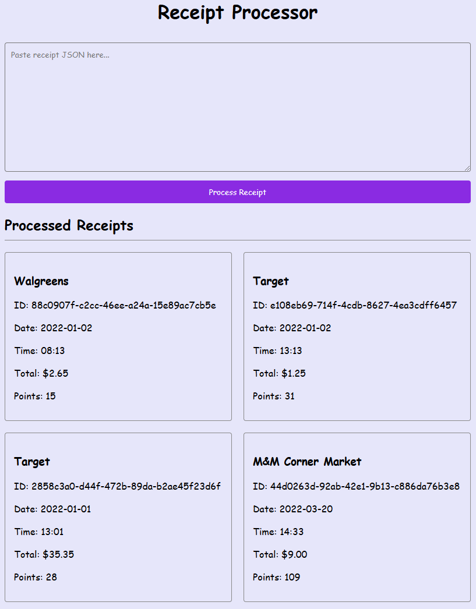

# Receipt Processor

An API and web application for processing receipts and calculating reward points based on specific rules. This repository was created as an exercise and will be made private once it is no longer required by the reviewer(s).



## Table of Contents
- [Features](#features)
- [Getting Started](#getting-started)
  - [Prerequisites](#prerequisites)
  - [Installation](#installation)
- [Usage](#usage)
  - [API Endpoints](#api-endpoints)
  - [Example API Calls](#example-api-calls)
- [Architecture](#architecture)
  - [Backend](#backend)
  - [Frontend](#frontend)
- [API Documentation](#api-documentation)
- [Note on Accuracy of Response](#note-on-accuracy-of-response)

## Features

- Process receipts and calculate points based on various rules
- View all processed receipts
- Web UI for easy interaction
- Minimal RESTful API for programmatic access as defined by the assignment

## Getting Started

### Prerequisites

- Docker
- Docker Compose

### Installation

1. Clone the repository:
```bash
git clone https://github.com/sn0rp/receipt-processor.git
cd receipt-processor
```

2. Start the application:
```bash
docker compose up --build
```

The application will be available at:
- Web UI: http://localhost:3000
- API: http://localhost:8080

## Usage

### API Endpoints

- `POST /receipts/process` - Submit a receipt for processing
- `GET /receipts/{id}/points` - Get points for a specific receipt
- `GET /receipts` - List all processed receipts

### Example API Calls

Process a receipt:
```bash
curl -X POST http://localhost:8080/receipts/process \
  -H "Content-Type: application/json" \
  -d '{
    "retailer": "Target",
    "purchaseDate": "2022-01-01",
    "purchaseTime": "13:01",
    "items": [
      {
        "shortDescription": "Mountain Dew 12PK",
        "price": "6.49"
      }
    ],
    "total": "6.49"
  }'
```

Get points for a receipt:
```bash
curl http://localhost:8080/receipts/{id}/points
```

List all receipts:
```bash
curl http://localhost:8080/receipts
```

## Architecture

### Backend

The Go backend is structured into several components:
- Main server handling HTTP requests
- Points calculation engine
- In-memory storage for receipts
- Configuration management

Key files:
- `server.go` - HTTP server and request handling
- `points.go` - Points calculation logic
- `storage.go` - Receipt storage implementation
- `types.go` - Data structures and types

### Frontend

The React frontend provides a user-friendly interface for:
- Submitting receipts
- Viewing processed receipts
- Displaying points calculations

## API Documentation

### Endpoints

#### Process Receipt
- **Path**: `/receipts/process`
- **Method**: POST
- **Request Body**: Receipt JSON object
  ```json
  {
    "retailer": "Target",
    "purchaseDate": "2022-01-01",
    "purchaseTime": "13:01",
    "items": [
      {
        "shortDescription": "Mountain Dew 12PK",
        "price": "6.49"
      }
    ],
    "total": "6.49"
  }
  ```
- **Response**: 
  ```json
  {
    "id": "adb6b560-0eef-42bc-9d16-df48f30e89b2",
    "points": 32
  }
  ```
- **Status Codes**:
  - 200: Success
  - 400: Invalid receipt format

#### Get Points
- **Path**: `/receipts/{id}/points`
- **Method**: GET
- **Parameters**: 
  - `id`: Receipt ID (path parameter)
- **Response**:
  ```json
  {
    "points": 32
  }
  ```
- **Status Codes**:
  - 200: Success
  - 404: Receipt not found

#### List Receipts
- **Path**: `/receipts`
- **Method**: GET
- **Response**: Array of processed receipts with their points
  ```json
  [
    {
      "id": "adb6b560-0eef-42bc-9d16-df48f30e89b2",
      "retailer": "Target",
      "purchaseDate": "2022-01-01",
      "purchaseTime": "13:01",
      "items": [
        {
          "shortDescription": "Mountain Dew 12PK",
          "price": "6.49"
        }
      ],
      "total": "6.49",
      "points": 32
    }
  ]
  ```
- **Status Codes**:
  - 200: Success

### Data Validation

All endpoints enforce the following validation rules:
- Retailer: Must only contain alphanumeric characters, spaces, and `-` or `&`
- Purchase Date: Must be in YYYY-MM-DD format
- Purchase Time: Must be in HH:MM format (24-hour)
- Items: At least one item required
- Total: Must be in dollars and cents format (e.g., 12.50)
- Item Description: Must only contain alphanumeric characters, spaces, and `-`
- Item Price: Must be in dollars and cents format (e.g., 12.50)

## Note on Accuracy of Response
This repository goes beyond the scope of the assignment, but it does satisfy all provided requirements.

Note that the `/receipts/process` endpoint handles the points calculation in addition to ID assignment. This is intentional and not in conflict with the requirements. As stated in the original `README.md`:

> Endpoint: Process Receipts
> - Path: `/receipts/process`
> - Method: `POST`
> - Payload: Receipt JSON
> - Response: JSON containing an id for the receipt.
> Description:
> 
> Takes in a JSON receipt (see example in the example directory) and returns a JSON object with an ID generated by your code.
> 
> The ID returned is the ID that should be passed into `/receipts/{id}/points` to get the number of points the receipt was awarded.

Performing the points calculation from this request and including the result in the response is not prohibited. I built the API this way in order to produce the web app for the convenience of the reviewer(s).

Likewise, the Get Points endpoint is described as "A simple Getter endpoint that looks up the receipt by the ID and returns an object specifying the points awarded." It is not specified that the points calculation has to be performed from this API request. The only requirement is that this endpoint returns the points value, which it does.

I have also included an endpoint to get all processed receipts, as described above. This was a trivial and logical inclusion.

I make these distinctions here because they may be at odds with your expectations, but they do not violate the stated rules of the assignment.

I had to stop myself as I was having fun, but I also thought to set up automated testing and deployment with Jest, GitHub Actions and Ansible. My ideas were increasingly out of scope and today is Thanksgiving, so I am cutting it off here. See [jobert](https://github.com/sn0rp/jobert) for an example of how I handle CI/CD and IaC as I would have for this project.